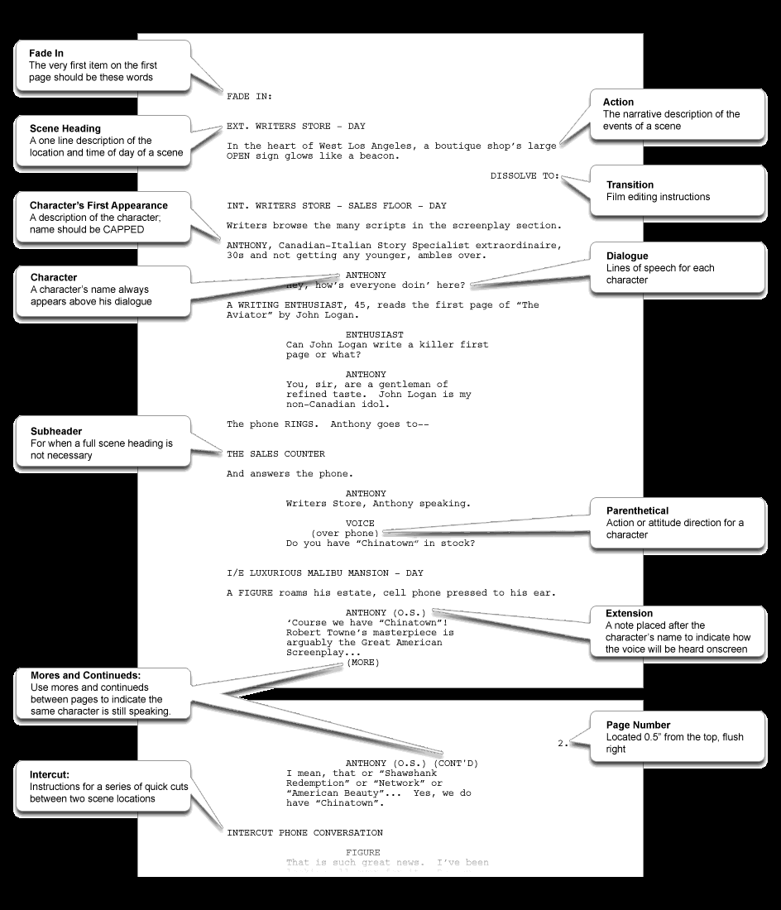

# Fountain剧本文件格式&语法

> 用 vscode 里面的 Better Fountain 插件

[官网及语法Fountain](https://fountain.io/syntax)

[我用 Fountain 一年了(少数派)](https://sspai.com/post/40467)

[用 Fountain 编剧：从入门到继续入门 - 少数派 (sspai.com)](https://sspai.com/post/35135)

[剧本网站](https://zhuanlan.zhihu.com/p/155798621)

[好莱坞标准编剧格式，不符合的直接丢垃圾桶](https://zhuanlan.zhihu.com/p/83020891)

- FADE IN | 淡入：第一个镜头的开始，象征着「这是一个电影剧本」
- Scene Heading | 标题：对于这场戏发生的时间（日、夜）和地点（内、外景，在哪）的描述
- Action | 行动：剧情事件发生的客观描述
- Transition | 转场：一场戏如何结束转到下一场
- Character‘s First Appearance | 角色的第一次亮相：名字全部用大写字母
- Character | 角色：下面一行就是他的对白（Dialogue）
- Subheader | 副标题：如果一个大场景内会需要小场景的戏，比如客厅里（大场景）的饭桌底下（小场景）
- Parenthetical | 伴随动作：角色在说对白的时候伴随的动作、神态或者特别指明这段对白是冲着谁说的
- Mores and Continues | 跨页对白：前一页在最后补个（MORE），后一页在角色名字后补个（CONT’D）
- Page Number | 页码：第一页剧本正文默认没有页码，从第二页（2.）开始按顺序排
- Intercut | 交叉镜头：在同一场戏中会有不同场景的镜头来回剪切，最常应用：打电话段落

有的情况需要在角色名后加Extension扩展，比如（V.O.）和（O.S.），VO即Voice Over，场景之外角色的声音——旁白或独白，这个好理解，OS即Off Screen是指角色不在镜头内发出的声音，比如说一个角色在书房写作业，这时他的母亲在厨房大喊一声“出来吃饭了”，这就是OS。敲黑板，OS不是中文所说的画外音，VO和OS要分清楚。

还有时候角色名后面会写（CONT’D），即“继续”。两种情况，一种是角色的一段对白被分隔到前后两页纸的时候，这样上页的对白结尾处会有（MORE）的字样，另一种则是同一角色的的话被Action分隔开的时候。这样标注方便了演员顺台词。

补充说明下，在Action动作段落中，每个角色仅在第一次出现的时候大写名字，并在后面的括号里，或者逗号之后写上岁数。有需要的时候我们也会标注性别，以及角色的简单描述。后面出现的角色名字则按正常写法书写。

常见的转场包括CUT TO切到，DISSOLVE TO溶解，MATCH CUT TO匹配剪辑，JUMP CUT跳剪等等。传统上许多编剧喜欢以FADE IN淡入，FADE OUT 淡出作为全剧本的开场和收尾，现在并不多见了，如果最后不以淡出作结尾，则需要写上THE END。

---

经过我的个人尝试，我总结出用 Fountain 来写剧本的几个具体步骤：

- 先敲两个 ##，开始写场号（第一场、第1场、Scene 1 全看个人喜好），换行
- 写一个 =，开始写这场戏的梗概（什么人做了什么事，达到了什么效果）
- 然后正式开始写戏。先打一个英文句号 .（强制标题），室内还是室外，具体什么地方，日戏还是夜戏（顺序可以按照个人喜好但必须全剧本统一）
- 人物动作、客观的描述性语言直接写
- 有人要说对白，人名前加 @
- 有转场，加 >
