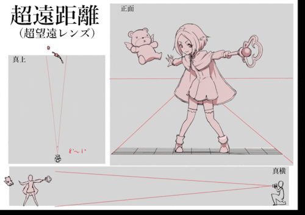
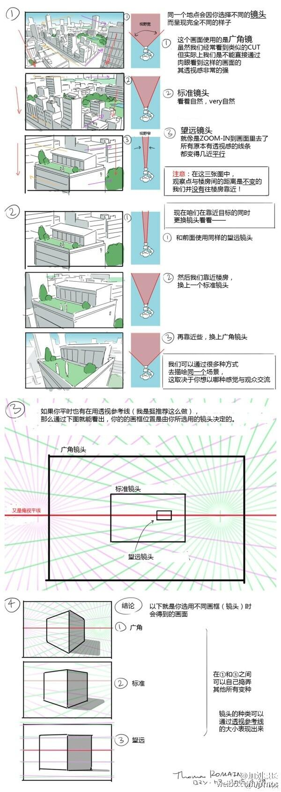
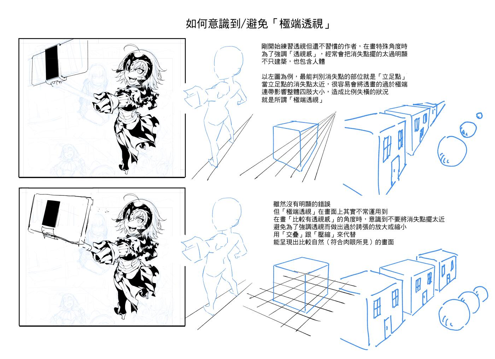
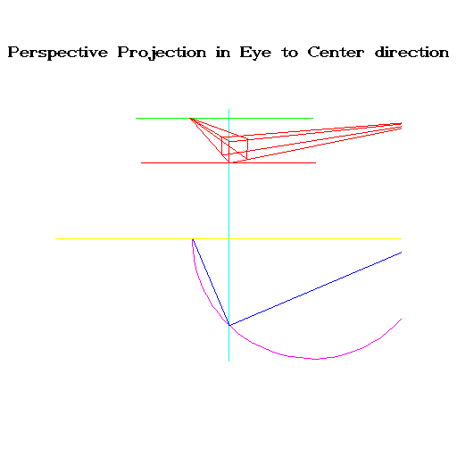
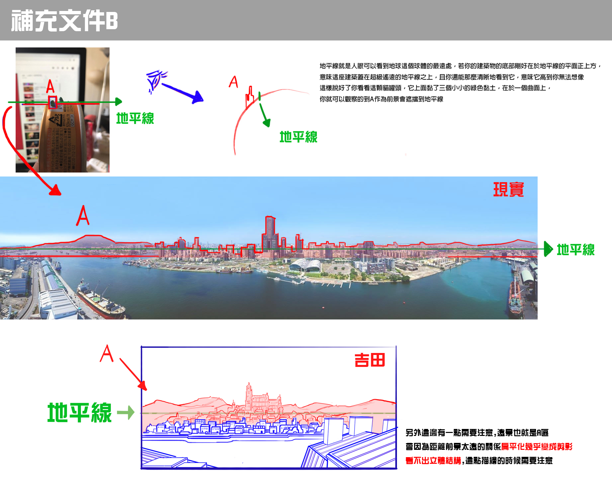

# 知识点 L1-L4

### L1

- 7分算，3分看
- 不要被数据绑死（视觉修正）
- 画前先研究三视图
- **先概括大关系**
- 相机参数：空间位置，焦距（广角，望远镜头，正常中距离镜头）
- 透视类型：方块和相机的相对关系
- 构图取景框和超过取景框的透视方块一同规划
- 一般都是中距离镜头
- 旋转比例479，方块大致1：3
- 
- 

### L2

- 练习熟练速写完善造型
- 熟背16格方块（骑士也就9个
- 
- 为什么要熟练16格方块：
  - 能熟练知晓那种是标准的参考系：心中有数
  - 能起草是拿出便准的参考，减少错误
  - 
  - 分析物体时能又熟悉有效的方法快速上手（如K大龙头）
  - 便于型准，比例计算
  - 便于调用简化的视角，景别思维
- 要做K大的这种练习（初期大量练习，以后研究新事物的时候练手）
- 
- 
- 要融入自己绘画习惯的好方法
- 比较微妙的z轴收缩省略掉省事，直接画2点透视，小误差忽略节能
- 要考虑视野范围（取景框&60°视锥）

### L3

- 4中角度的旋转足以做出生动随机的旋转摆放了
- 画线的时候记得CSI，对比构成
- 变形工具黑科技
- 人体先装在盒子里画比例，在画枕头人（之后速写完善）（也不一定）
- 焦距与视框
- 先分析物体结构，研究一下三视图再开画
- 
- 极端透视不常用到（真的吗？）
- 

### L4

- 画师要可以制造空间感，缩放**暗示**。比如透视盒子的摆放-近中远（比如小石子，树），结构的折叠遮挡（很多角色设计，但是要图形化）
- 从构成/图形层面讲，相似的物体轮廊重复出现会形成韵律
- 作为画家，我们也有必要对画面中出现的元素 （轮廊类型） 做种类总量控管
- 从真实环境设计来讲，本来一个地理环境中会出现的建筑风貌/植被轮廊特征会有一致性。大致上三到五种元素就足以构成一个丰富的画面
- 中线意识：做曲面物体体块（例如人体）时，如果难以用对角线求中线，S S通常是主观把远的那面压窄一点
- 技巧：
  - 大约四到五间房屋（展示距离收缩）可以架一面遮挡墙
  - 地平线是视线最尾端，通常在地平线前就会有东西遮挡
  - 远景的山/陆地/远处街道等，在地平线真正出现前就遮住
  - 从构成的角度来看，做遮挡也是避免太过直接的米字型集中线构图
  - 遮挡墙也可以说是设计来画分前中远景，让前中远景的距离计算不会那么明显有破绽
  - 建筑接地面的结构需要交代清楚但很难处理的部分，也会利用遮挡技巧避开
- 画面要好看光有透视还不够，还有有构成和设计
- 速写默写，积累脑内图形库，对比例和斜率极其敏感
- 写生
- 概括：人体就是透视
- 学习对象（记得一定要分析临摹，学习默写，结合构成）：金政基，K大线稿
- 
