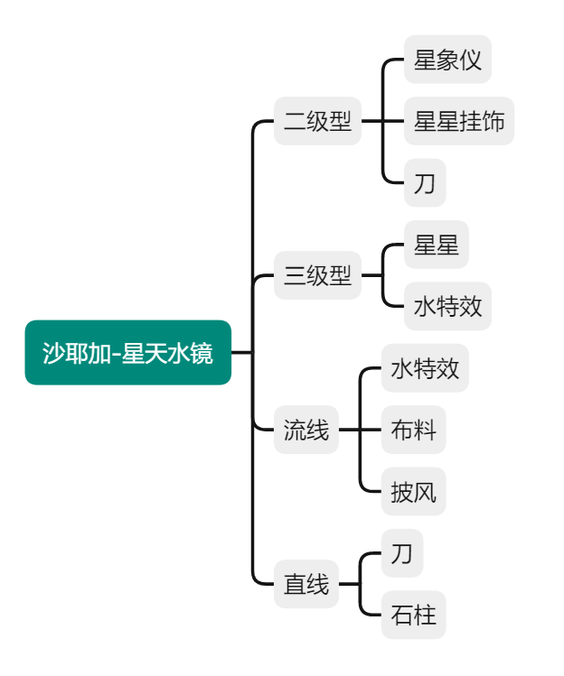
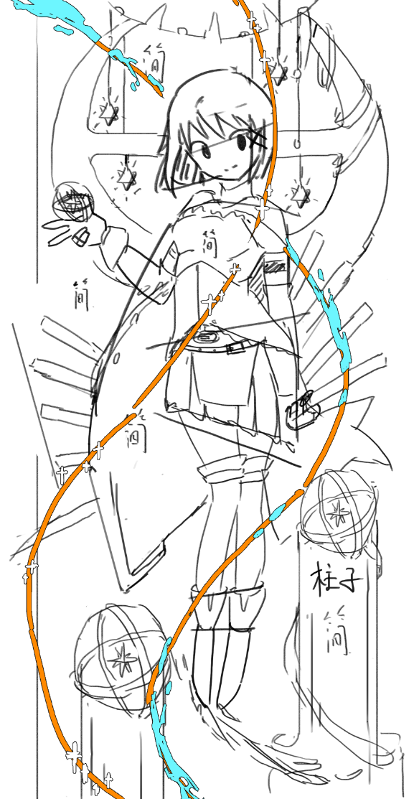
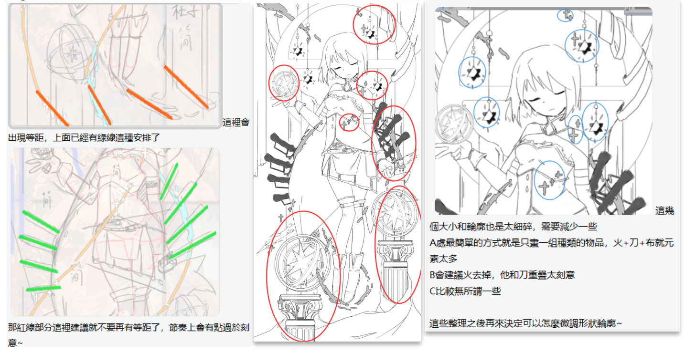
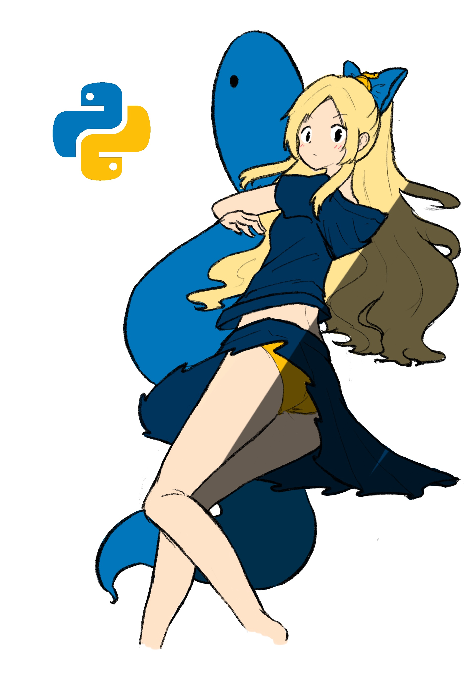

# 构成心得

① 北京时间 08:00-20:00，发送到 A 邮箱：1708662062plxxq.4d1d2e9@m.yinxiang.com

② 其余时间，发送到 B 邮箱：3008615021qjqrg.39369bf@m.yinxiang.com

邮件标题：QQ-昵称-构成7期-作业心得-所选作业

2937978529-哈比-构成7期-作业心得-L8毕业作品

## 正文

① 你的昵称：Badbrain

② QQ号码：1522975492

③ 联系邮箱：1522975492@qq.com

④ 申请好宝宝的课程期数：构成7期

⑤ 作品展示：

⑥ 绘画/思考过程：

心智图：

自己选题的时候，面对无穷无尽的题材反而会无从下手，什么都想画，但是需要精力去思考一个具体的主题下的元素组合，所以首先是要头脑风暴，可以先莽着定一个自己喜欢的IP，之后就在范围中去选择，往往要顺利的多， K大提供的材料选题也是同样的道理。

这次L8我就需要构成的画面的几个部件进行构想，人物主体，二级型，三级型配合流线型做出贯穿画面的动态线，支线和曲线缠绕增强直曲对比。

参考图：

要画什么有个范围之后，我们就可以去先确定一个大的主题，比如我就画沙耶加了，先会有模糊的雏形，但是里面的细节元素可能还不清楚，要水吗，什么样的水，是做部件主体的大片水帘，还是三级特效水滴，或者趋势线的水流，这个时候就需要去找很多很多参考，在过程中我们看到大量相关的元素，我们就会迸发出很多的灵感，然后要记在纸上，以防忘记，之后再进行筛选。

除了找真实物体的照片，也可以多看一看其他画师，处理同样人物的想法，在其基础上做出一些发散的变化，也可以避免抄袭，变成属于自己的创作。

不过素材最终用什么，还是会在草图的绘制中尝试各种搭配，最后看实际效果确定出自己认为最合适的组合。

找参考会花很多时间，但是为最终画面效果的提升是非常大的，好的元素组合，都是很合理的，不会有元素的突兀。

⑦ 绘画流程：

最开始画粗草就要安排自己画面的疏密对比，物件摆放，还有动态线的穿插关系，这也符合大中小长中短，疏密曲直的标准来，让每一个元素都是有意义的，而不是胡乱填充画面，多次从自己找到的参考物件元素物件尝试组合去符合穆夏的动态线，不过不用非常强硬的完全贴合，稍微有一些变化也是可以接受的，这一点其实我最开始是没有意识到的，非常感谢助教的指导。

其实这个阶段用笔应该还是应该再细致一些，让物体更明确一些，才能看出自己想要的效果有没有偏差，现阶段我还没有办法做到下笔明确，结构准确，所以有些问题这时被掩盖了，就比如下面的星象仪原本是非常复杂的，但是自己画出来就比较简单，后期改成精细的草稿之后，就会导致下方细节比头部多会吸引视线。

在下一阶段之前，根据助教的反馈进行修改，问题真的是很多啊，自己思考如何根据学到的知识，来解决画面中出现的问题。

最后调整了飞行道具的复杂程度，换成了简单的版本，并且在调整人物的站位在1/3线上，把一些过于密集的元素重新修改了一下，感觉有些不太好修改，最后就决定加一点黑白对比来，将视线引导到脸部。

最后交给助教检查通过后，只需要耐心的将线稿绘制清楚就完成了。

完美的在实践中检验了自己在课程中学到的知识，虽然有些问题还需要助教指导，但是相信多多练习之后我自己也能指导我自己。

⑧ 感想：

心得：

课程最重要的知识还是‘对比’，时刻提醒自己大中小，长中短，曲直对比等等，转化为自己的被动技能，虽然还不是很熟练，但是通过这次课程还是明白了究极是怎么运用的，并养成画图看图分析构成动笔的好习惯，让画的每一笔都是有意义的，都是为了表现出某种‘对比’。

除了课上练习会使用线条绘制物体来做对比外，颜色其实也是构成的很重要的部分，黑白的分布也会引导视线。这次作业我把最重要的脸部用的很多黑白和疏密对比，而不重要的部分，则降低了黑白对比，原来没上黑色的时候，下方的石柱有一些吸引视线，可以通过这种方法来挽救画面效果。

还想提高的地方：

由于我学习K大的透视色彩构成是三开，在短短的4个月内就学完了，整个内容感觉有点吃不下，用来巩固基础知识的时间都没有多少，学习知识确实是不能一口吃成胖子，还是建议大家早学习，慢学习，把知识吃透了，练习过程中实际运用了才能取得最好的效果。

当然我也不能止步于此，学无止境，我会一直努力下去的，加油！

⑨ 学前作品：

没什么学前作品，大多数都是胡乱临摹的，这些体现的都是别人的水平，而且临摹的还一点都不准哈哈哈哈。在半年之前，基本是不明白这些练习的意义和标准，所以说都浪费了很多时间，就全当培养爱好了吧。

花钱买时间真的是非常的重要，时间就是最宝贵的财富，很庆幸能遇到K大团队。

最后：

感谢K大团队4个月的陪伴，大家都很善解人意，很贴心（毕竟干这行最重要的是耐心/dogo），希望K大团队越站越好，把实惠的知识和服务，送到更多想学习画画人的面前，为他们指引正确的方向。
