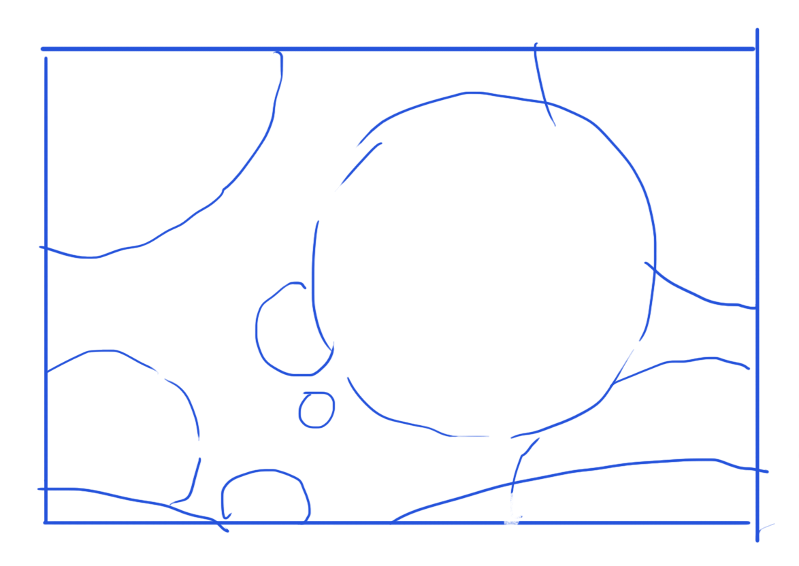

> **构成就是“对比”**，全部都是对比，各种的对比，常用的对比（疏密，大小，长短，多少，刚柔、简繁），概念的对比，空间..

## L1

- 物体拆解 要进行构成归纳
- 
- 正负形对比
- 点线面（功能性上，并非严格的点与线与面），各司其职，相互通用
- 大中小
- 
- 望月けい
- 
- 
- 
- 
- 有很多本身就自带对比构成的物体和手法就要内化：
  - 透视地板（石子）
  - 
  - 光影大小分
  - 构图形式
  - 人体
  - 经典pose
- 

- **简单几何形：简单概念入眼，最简单的冲击，最直观的感受（有情绪）**
- 

- CSI：概括与对比
- 主题内容小技巧
- 物件分析：集合体概括，构成整理，练练手
- 图中的流线视觉引导（插图就一张图，流线在图内，漫画流线在故事分镜节奏上，影片切帧，流线在剪辑分镜上）

## L2
- 动笔前，要知道在画“点线面”的哪个功能的图形
- 知识点有点杂
- 
- 动态线就是要明显，要一眼就看出来，别藏着掖着
- 吉成曜，我的超人！
- .jpg).jpg).jpg)
- 前面几页的思路不错
- 简单几何入眼

## L3
- 细节的基本CSI和对比构成 以外，要更重视主体的关系
- （简而言之就是大关系>小关系）
- 大关系不止光影，明暗，大小体块等具象信息，还有**大动态线，构图，概念**
- 下笔要清晰，要勇敢，型才会出来
- **概括！！！**
- 观察——提炼——重组构成
- 从**好看的外轮廓**入手，梳理合适的结构。（蚂蚁的道具球有类似的知识点）
- 
- 

## L4
- 
- #TODO **外轮廓！！**
- #TODO **零件重组**（说的就是你，人体）（当然，还要加动态速写）
- 反转，缠绕，卷缩，增加物体空间感，尽量多展示物体角度（三个面）
- “重组力 & 轮廓力”
- 找参考
- 每次遇到新物体时，都要拆解结构，研究一番
- 从高手的图中提取符号
