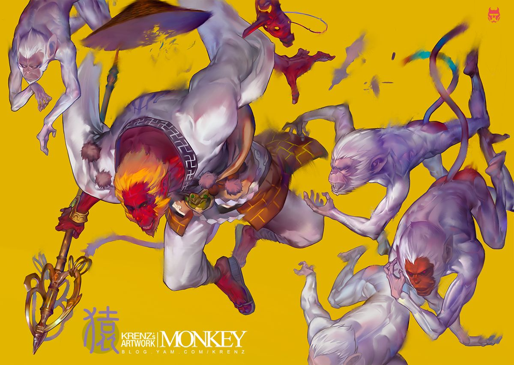

## L5
- 元素间距：左右间隔，高低落差，远近分布，近实远虚，近大远小……（综合运用）
- 趋势，群落，元素，层层递进
- 多看看图
- 构成的排布还是挺花功夫的嗷，多练，多看大佬怎么画图形的，多记忆一些图形
- .jpg)
- 
- 
- 
- 

## L6
- 多看图，多了解底层原理结合高效工具
- 
- 
- 

## L7
- 对比和趋势记得做清楚明了，不要模模糊糊，就是要观众一眼就看出来
- 插画的**视线流动**在图中不断循环，复数流线和元素有机巧妙组合形成**趋势**
- 8字流线，∞无限符号流线
- 构成，大中小
- 从外轮廓入手，一次性完成一个图形，然后组积木
- 
- 
- 多看大佬的图，太好看啦！！

## L8
- 