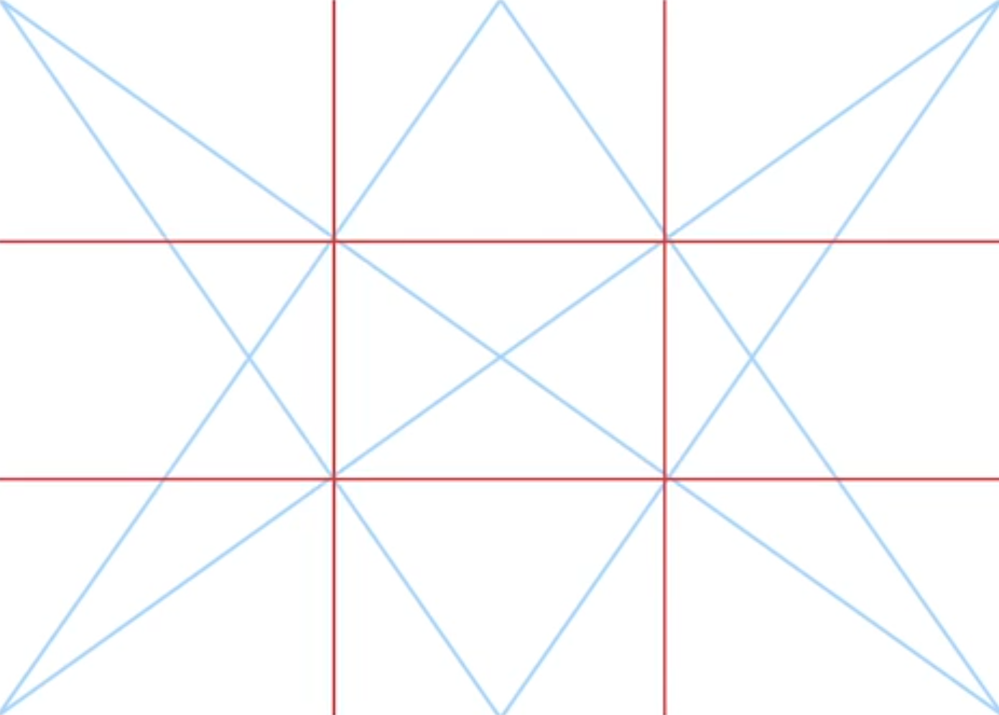
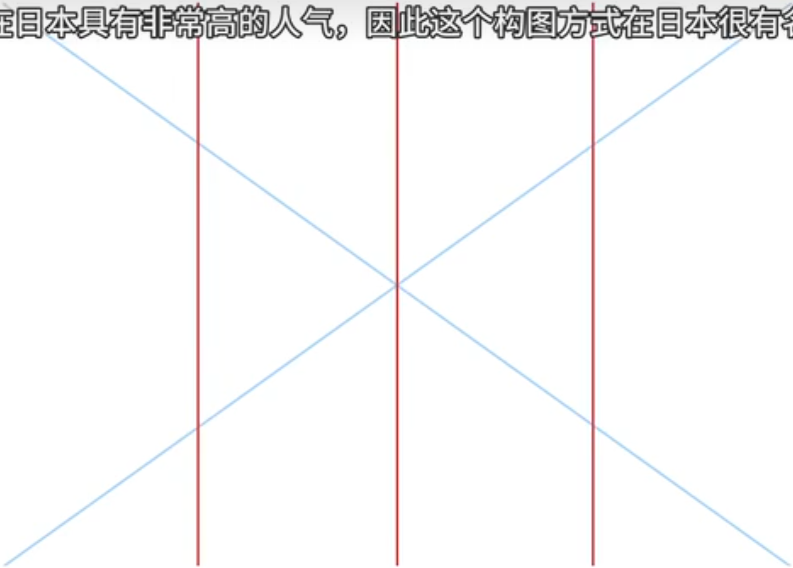
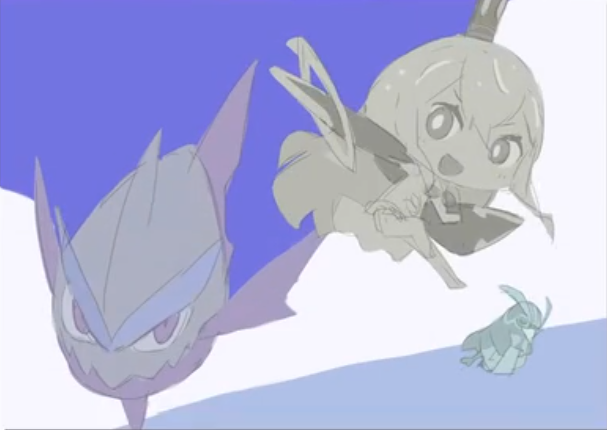

> 魔法般的构图方式！帮你画出有魅力的作品【初学者教程02】_哔哩哔哩_bilibili
> https://www.bilibili.com/video/BV1sY41187vv/?vd_source=b40ab89bb5b1b338a09d8ce5d6a1fbaf

三分法

主角放在三分线上，配角放在次级线上，不重要的要避开辅助线（如此图中的背景-云）

铁路人构图：更广阔的空间感

除了构图之外其实还有一部分没讲到，不过老师已经冥冥之中展示出来了，画面中的人物要有交互感，而不是单独的个体，如果人物之间互不相干的话，就会显得像家庭合照一样，缺乏韵味

---

> 醒醒吧，你真的不懂构图！从根源上颠覆你对于摄影构图的认知！_哔哩哔哩_bilibili
https://www.bilibili.com/video/BV1Do4y1o7Xg/?spm_id_from=333.337.search-card.all.click&vd_source=b40ab89bb5b1b338a09d8ce5d6a1fbaf

决定性瞬间（街拍，插画，漫画，慢镜头）
典型性瞬间（印象的提取化）

构图：平面的秩序，点线面的构成，图形的分布组合（摄影师之眼），所有的元素都**各得其所**，元素的有机结合。

形式与内容相结合

《摄影师之眼》《照片的本质》
链接：https://pan.baidu.com/s/1liNLdztHMR3Xfrv0fmYljg  
提取码：o722

---

中心构图：主体突出、明确，而且画面容易取得左右平衡的效果。这对于严谨、庄严和富于装饰性的摄影作品尤为有效。

水平线构图：最基本的构图法，以水平线条为主。水平，舒展的线条能够表现出宽阔、稳定、和谐的感觉，通常运用在湖面、水面、草原等等。

垂直线构图：画面中以垂直线条为主。通常运用垂直线构图的时候，被摄体自身就符合垂直线特征，例如树木。垂直线在人们的心里是符号化象征，能充分展示景物的高大和深度。

三分线构图

对称构图

对角线构图

引导线构图：利用线条引导观者的目光，使之汇聚到画面的焦点。

框架构图：将画面重点利用框架框起来的构图方法，会引导观者注意框内景象，产生跨过门框即进入画面的感受。由于框架亮度往往暗于框内景色亮度，明暗反差大，要注意框内景物的曝光过度与边框曝光不足的问题。

重复构图：当主体是一群同样的东西，将这一群主体同时拍下来的构图方法。单调地重复统一物体，占据整个画面并且没有明显杂乱的其它物体出现，同样可以起到突出主体的效果。

三角形构图：稳定与秩序
均衡式构图：元素构成平衡

黄金三角构图

填充构图（特写）：让画面主休尽量地填充满整个画面

封闭式构图/开放式构图：物体是否被边框截断以引导联想画框外的空间

> 这就是几种常见的构图方法。通过例图也可以看出，构图方法并不是死的，一张照片通常都是杂糅了几种不同的构图方法，所以将基本构图方法熟记于心，并经常观察、经常实践才是提高构图能力最好的办法。

其他原则：
- 制造空间纵深
- 元素数量关系，单数，双数，成对，成群
- 留白
- 发现图案和纹理：人类天生就会被图案所吸引
- 确定主角与配角，背景