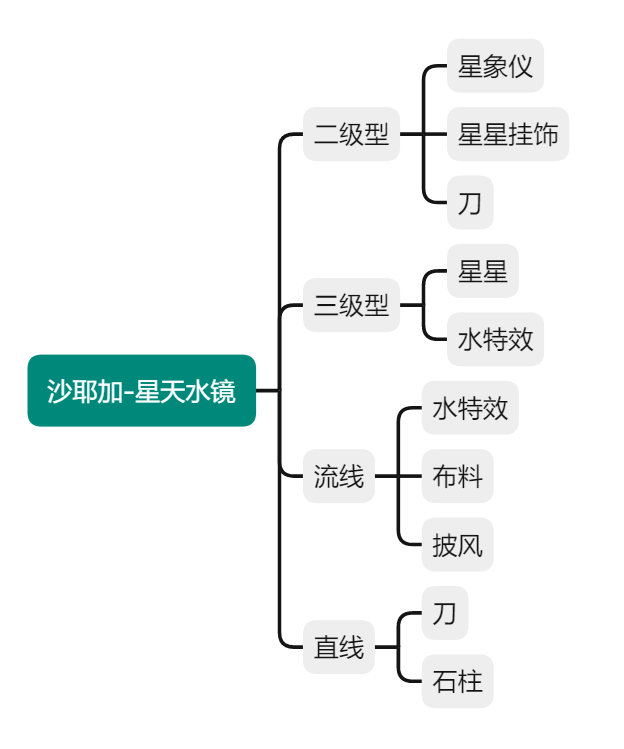

# 构成心得

① 北京时间 08:00-20:00，发送到 A 邮箱：1708662062plxxq.4d1d2e9@m.yinxiang.com

② 其余时间，发送到 B 邮箱：3008615021qjqrg.39369bf@m.yinxiang.com

邮件标题：QQ-昵称-构成7期-作业心得-所选作业

2937978529-哈比-构成7期-作业心得-L8毕业作品

## 正文

① 你的昵称：Badbrain

② QQ号码：1522975492

③ 联系邮箱：1522975492@qq.com

④ 申请好宝宝的课程期数：构成7期

⑤ 作品展示：

⑥ 绘画/思考过程：

心智图：

自己选题的时候，面对无穷无尽的题材反而会无从下手，什么都想画，但是需要精力去思考一个具体的主题下的元素组合，所以#TODO
首先是要头脑风暴，

参考图：

（提示：此处可说明你选择参考时的想法，你在毕设中想表达什么主题？怎么想到选择这些作为参考的？）

⑦ 绘画流程：

（此处说明你的绘画流程，从草稿到成图的过程中遇到了哪些问题？如何发现、解决的？请展示出你毕设的各个节点，和遇到问题时修改前后的对比图。如果有助教帮助过你，最好附上助教的修改建议截图~）

⑧ 感想：

心得：

（有什么是你觉得自己做的还比较好的地方？或者学到了什么新技能？把你的经验分享给大家~）

还想提高的地方：

（这个过程中你发现了自己在哪些方面还可以提高？你还想要继续努力的方向是？）

⑨ 学前作品（选填）：

（提交学习 K 大 课程之前的【原创】作品即可，若没有学前作品可不附）

最后：

（有什么想对K大团队说的呀~）
