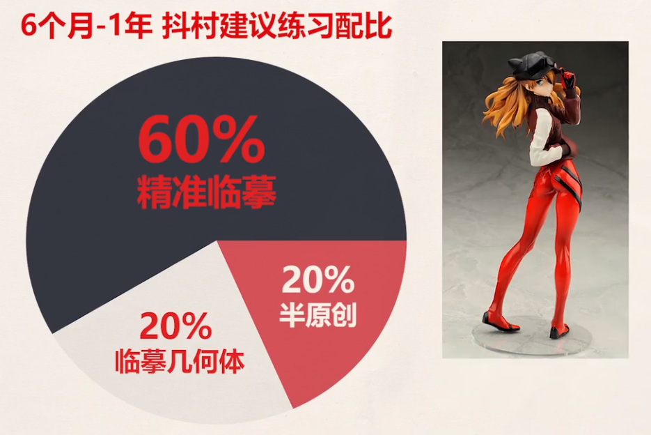
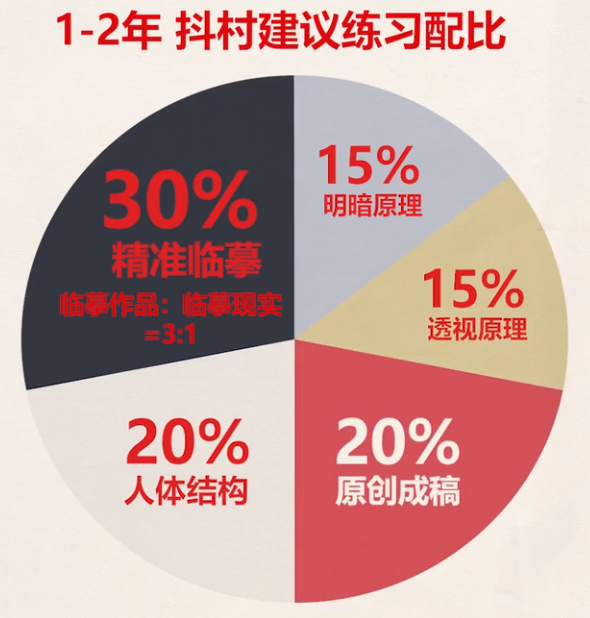
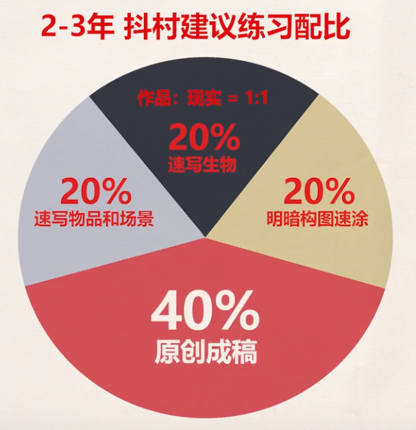
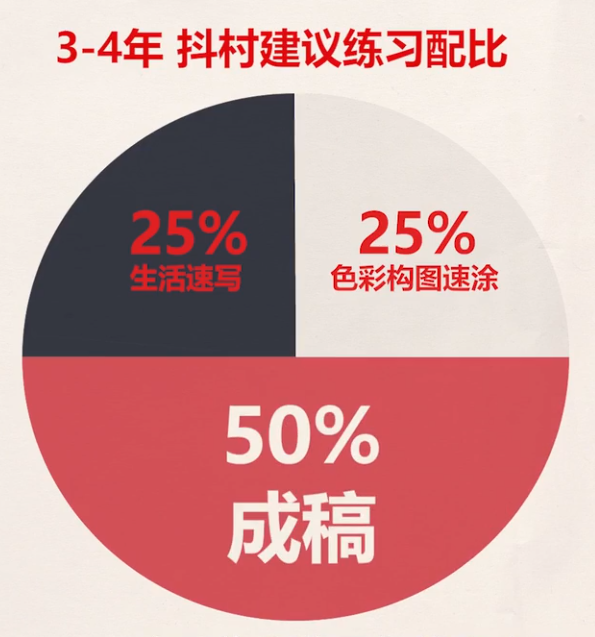
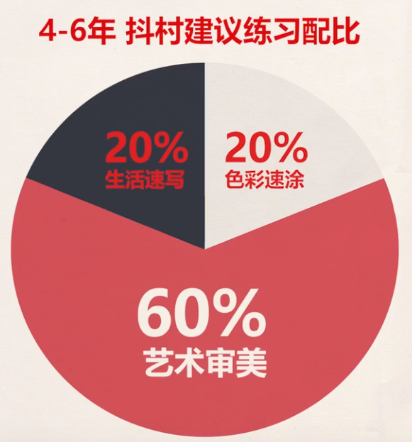

# 完美时间表

2021年看的[【抖抖村】有这张时间表,再也不担心每天练啥!绘画前6年最快升级日程表](https://www.bilibili.com/video/BV1a44y1C7Dj)

挺赞同的（按每天至少3小时计算）

## 总结

## 评论区课代表

0-6个月 画就完了注意运笔（我应该在这阶段时长不够）
6月-1年 60%精准临摹
        20%速写几何体20%半原创 
1-2年可报班 30%精准临摹 15%明暗原理
        0%人体结构 20%原创成稿 学会软件
2-3年   20%速写生物（作品现实1∶1）
        20%速写物品和场景
        20%明感构图速涂
        40%原创成稿
3-4年   25%生活速写
        25%色彩构图速涂
        50%成稿
4-6年   20%生活速写 20%色彩速涂
        60%艺术审美 摄影去吧

---

日程表笔记
“The Perfect Schedule”
前提：每天三个小时以上地进行绘画的“刻意练习”，建议去看《刻意练习》这本书。
0～6月，480h左右

重点培养兴趣，大多数大师在孩提时就完成了，提升线条稳定性，熟练用笔。
不要报班，否则可能成为理论家，

6～12月，480h～800h，不建议报班

60%投入“精准临摹”线条类作品，把形画准是学习其他技能的前提，重点在用形状“还原”
20%临摹现实几何体，我认为这里大多数时间不需要用颜色，这是下一个阶段练习的。
20%半原创，组合两个以上的作品

1～2年，800～1200h，可以报靠谱的班
（要虚心，因为此时只是入门）

30%进行精准临摹，他人作品：现实=3：1
15%进行明暗练习
15%透视练习
20%人体的结构，动态
20%原创，重在完成，实力大幅提升后再来改，我认为可以找先辈进行练习方向性的解答。
进军数码绘画者需要熟悉软件使用

2～3年，2000h
20%速写生物，作品：现实=1：1
20%速写物体与场景
20%明暗构图速涂，辅助简单的色彩练习
40%，画2～3张成稿，以成稿为导向找薄弱点练习，我认为应该找个“老师”给予反馈
（可以抽时间细致临摹喜欢的作者的作品）

3～4年，3500～4000h
真正的瓶颈期，基本进入专业绘画工作
以“比自己更强”为目标，
25%生活速写，积累素材（五秒拔枪）
25%明暗色彩练习
50%画展现自己研究成果与水平的成稿
回到前三年的基本功，了解更深层的内容

4～6年，5000h+
保持画技的同时，了解并学习绘画以外的事物（以历史，哲学等来武装自己的思想）
20%生活速写，积累素材
20%色彩速涂
60%提高审美，学习艺术哲学（了解艺术史，艺术家传记，导演解析电影，故事创作）
（可以挤出10～20%学习摄影）
后记：保持热情，坚持，才能在绘画道路上走得更远。
没有完美的日程，就像没有完美的人生，参考日程，“不完美”
地走下去吧，有时候，接受不完美也是一种快乐。

---

首先每天三小时及以上的正确练习时间，根据实际情况调整。
1. 0-6月 积累兴趣，可以临摹喜欢的老师也可以原创摸鱼总之积累兴趣 注意运笔
2. 6个月-1年 60%精准临摹线稿清楚的作品 20%临摹现实中几何体、速写 20%半原创，即组合临摹的图案
3. 1-2年 在完美执行以上的基础下，你已经积累了800-1200h的正确练习时间 可以在这个阶段报一个靠谱的班
 30%精准临摹 临摹作品和临摹现实3:1  15%的时间学习明暗光影原理  15%透视原理 20%人体结构，记清楚人体各部分比例、熟悉一些动态画法 20%原创成稿追求完成度高
4. 2-3年 正确绘画时间积累到2000h左右 进行速写  20%速写人体、动态、动物 临摹作品和现实1:1 20%速写现实场景积累素材和提升透视 20%速涂现实摄影和电影中的明暗、构图，辅助一些简单色彩练习 40%原创成稿 如果喜欢某种画风可以从以上3、4项中抽出时间细致临摹喜欢老师的作品 这个阶段要以成稿为导向 完成花100h及以上的时间的作品2、3张 在绘画途中如果发现薄弱可以去提升再来画
5. 3500-4000h左右 的一个真正意义上的瓶颈期 25%速写 25%明暗色彩速涂 50%成稿 
6. 5000h以上 一般都是绘画战士了所以成稿本身会占据大量时间所以不用再专门分配时间 20%速写 20%色彩速涂 60%学习艺术家传记、艺术历史导演解析电影、故事创作等领域 有机会的话可以寄出10-20%时间买一个便宜轻巧的微单去摄影，可以大幅加乘光影构图设计能力
7.人生总有意外不小心没坚持没关系，爬起来继续向目标前进就好了
7. 