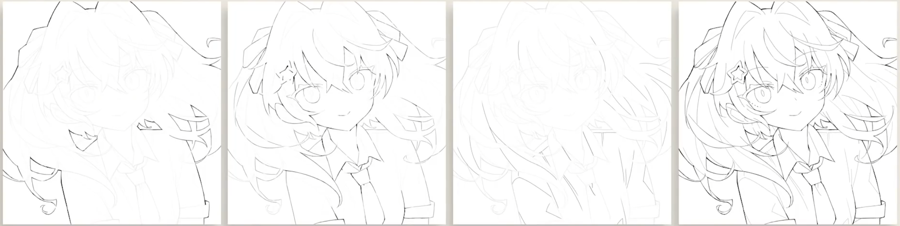

# 好看的线稿

## 通用技巧

[注意！你画不好线稿可能是因为犯了这6个错误_哔哩哔哩_bilibili](https://www.bilibili.com/video/BV1GZ4y1976E?spm_id_from=333.999.0.0)

- 数位板宽高比匹配屏幕

- - 粗草（确认构图，浅蓝色，其实还是越准越好）
  - 细草（抓型，暗红色，明确结构）
  - 线稿（细致勾线，设计线条粗细变化）

- 分工线条
  - 外轮廓线（1级）
  - 部件线（2级）
  - 细节线（3级）
  - 
  - 
  
- 选择性使用

  - 重力线
  - 光影线
  - 张力线
  - 质感线（物体的软硬虚实）
  - 停顿线=转折线=关键线
  - 闭塞

- 支线

  - 叠线

  - 棱角线

  - 断线

		> （注意这些都不是蹭线，线条是明确的）

## 步骤技巧

[7个实用线稿技巧，初学者也能掌握！_哔哩哔哩_bilibili](https://www.bilibili.com/video/BV15341147cU?spm_id_from=333.999.0.0)

---

## 线条风格化(进阶)

[【日语中字】提升线稿实用技巧，帮你画好线条！（Saitou Naoki）_哔哩哔哩_bilibili](https://www.bilibili.com/video/BV1Ci4y1V7dt?spm_id_from=333.999.0.0)

