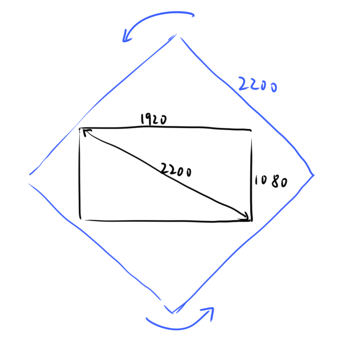
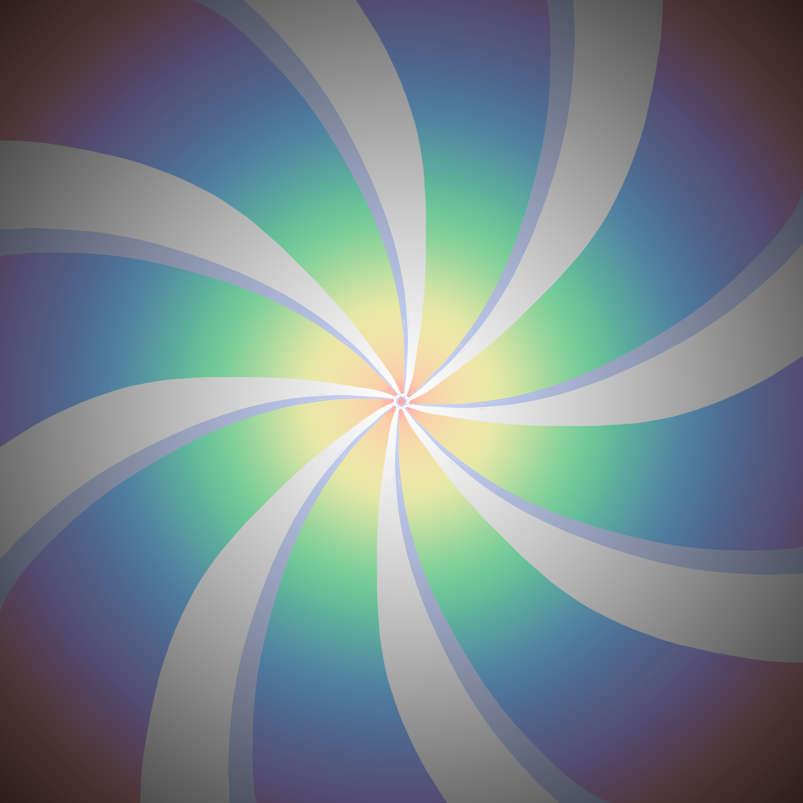
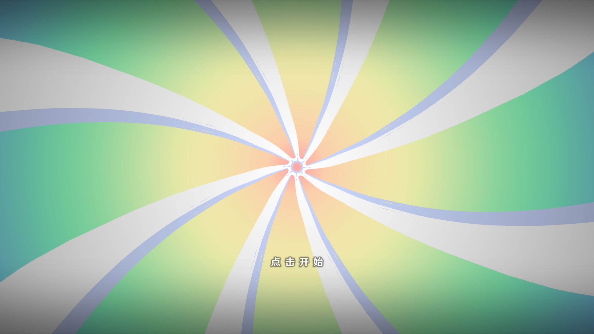
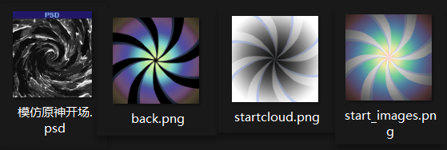

# 开场小动画

我想模仿一个原神"点击开始"的小开场，其实用AE，PR，以及其他现成的关键帧编辑器都可以很快的做出效果，打几个关键帧调调参数的事，几分钟就搞定了。

但是要用代码实现，就稍微麻烦一些。

## 逻辑

虽然说麻烦，但是制作逻辑是一样的:

1. 添加图片，由黑显示，慢慢旋转，然后停止
2. 显示'点击开始'动画，点击后执行下一个动画
3. 图片快速旋转，向中心放大，亮度提升至全白
4. 结束动画，返回主菜单

## 图片素材的准备

主素材，彩虹漩涡:

屏幕1920×1080px，考虑到素材需要旋转不穿帮，图片最短要约2300px左右(勾股定理计算)，保证清晰度。





点击继续:

在PS里用1920×1080画布调整文字大小，可以比较直观的看见效果，导出png图片使用，因为这里调用只能使用图片，不像现成的编辑软件可以添加一个文字框即时编辑字体大小颜色和位置透明度什么的，这就是头部软件的便捷之处，应该要拥抱先进生产力才行.

点击继续的黑边提示:

同样在上面的画布上直接制作，用渐变制作，单独导出.




这样要用的素材就准备完成了，当然这是最终的版本，此前会花很多时间进行尝试和调整，比如:

先百度找些类似的图片旋转效果，画图过程中的色彩调整，尝试各种想法，最终黑场还是白场等等.



## 代码实现

就上标识一些实现步骤，需要一些工地音乐技能加持，按照缩进应该还是很好阅读的，#是注释.

```python
## 主菜单之前call'点击开始'

## 调用splashscreen(开场)功能函数
label splashscreen:
    ## screen press_to_start在screen里单独设置

    ## 慢旋转
    ## 显示start_image(就是彩虹漩涡)在master图层上
    show start_images onlayer master:
    	## 像素变化功能开启
        subpixel True 
        ## 定义图片的x轴y轴的旋转锚点在中心0.5/1
        xanchor 0.5 yanchor 0.5
        xalign 0.5 yalign 0.5
        
        ## 下面3个parallel功能块同时执行
        parallel:
        	## 设置图片初始放大倍数为1.0
            zoom 1.0
            ## 按照easein_quad动画曲线模式,在3s内放大至1.05
            easein_quad 3.0 zoom 1.05
            
        parallel:
            ## 设置图片初始旋转角度为0
            rotate 0
            ## 按照easein_quad动画曲线模式,在3s内旋转20°
            easein_quad 3.0 rotate 20
            
        parallel:
            ## 设置图片初始亮度为全黑,BrightnessMatrix(-1.0),其他需要定义但是不会变化
            matrixcolor InvertMatrix(0.0)*ContrastMatrix(1.0)*SaturationMatrix(1.0)*BrightnessMatrix(-1.0)*HueMatrix(0.0)
            ## 按照easein_quad动画曲线模式,在3s内亮度变为原始正常图片的0.0,BrightnessMatrix(0.0)
            ease_quint 3.0 matrixcolor InvertMatrix(0.0)*ContrastMatrix(1.0)*SaturationMatrix(1.0)*BrightnessMatrix(0.0)*HueMatrix(0.0)
	## 停止3s上面的show语句执行完而不跳过执行下面的程序
    pause(3)

    ## 点击继续
    ## 回调'点击开始 press_to_start '功能模块,用完返回这里,并用0.2s的溶解效果显示,代码在其他地方定义,之后讲
    call screen press_to_start with Dissolve(0.2)
  
    ## 快旋转
    ## 显示图片的同时执行动作
    show start_images onlayer master: 
        subpixel True 
        xanchor 0.5 yanchor 0.5
        xalign 0.5 yalign 0.5
        
        ## 1s内easeout_circ旋转500°
        parallel:
            easeout_circ 1.0 rotate 500
		## 1s内easeout_circ放大至15倍
        parallel:
            zoom 1.05
            easeout_circ 1.0 zoom 15
            # power_out6 0.5 zoom 3.0
            
        ## 1s内easeout_circ亮度变为1.0(全白)BrightnessMatrix(1.0)
        parallel:
            matrixcolor InvertMatrix(0.0)*ContrastMatrix(1.0)*SaturationMatrix(1.0)*BrightnessMatrix(0.0)*HueMatrix(0.0)
            easeout_circ 1.0 matrixcolor InvertMatrix(0.0)*ContrastMatrix(1.0)*SaturationMatrix(1.0)*BrightnessMatrix(1.0)*HueMatrix(0.0)
	## 停止1s
    pause 1.0
	## 返回主菜单
    return

```

还有定义的press_to_start功能

```python
## 开场 点击功能
## 定义一个显示渐变黑边的变换,之后下面使用
transform splashscreen_start_black:
    alpha 0.0
    ease 0.5 alpha 1.0
## 自定义的图片闪烁变换(transform)
transform transform_blink:
    pause 0.5
    linear 1.0 alpha 0.0
    linear 1.0 alpha 1.0
    pause 0.5
    ## 循环'点击开始'文字的闪烁的此变换
    repeat
        
## 点击开始动画和事件检测
screen press_to_start():
    ## 这步确保任何其他菜单界面都会被替换
    tag menu
    ## 用上面定义的渐变黑边显示变换显示渐变黑边图片
    add "gui/logo_start/background.png" at splashscreen_start_black
    ## 先定义图片的位置在x轴0.5,y轴0.8处(大概就是屏幕中心偏下),然后用定义的循环闪烁动画显示相应图片
    add "gui/logo_start/press_to_start.png" xalign 0.5 yalign 0.8 at transform_blink
    
	## 事件热区检测,图片热区
    imagemap:
        ## 用一个1920×1080的透明图片检查点击事件,也就是全屏随便点击都可以出发
        ground "gui/logo_start/transparent.png"
        ## hotspot (0, 0, 1920, 1080) focus_mask None action(Play("sound", "audio/start.wav"), Return())
        ## 这里点击可以添加一个'飕'的音效,不过我没找到好的,就关了
        ## 点击事件发生,就返回
        hotspot (0, 0, 1920, 1080) focus_mask None action(Return())
```

## 尾声

你们可以看到，这些实现起来还挺麻烦的，也许用更专业的Unity，Unreal会有更多别人做好的工具可以使用，先进生产力啊，不应该重复造轮子，没有多大意义。

真的没有多大意义吗，那我有现成的工具可以使用吗，好像并没有啊。

我演出需要的变换是没有的，都要自己写啊，像人物靠近屏幕放大，蹦蹦跳跳，受击震动，喝醉了摇摇晃晃，位移到另外一个角色立绘背后贴贴，这些都是没有的!!!

一个都没有!!!

这些演出还需要加音效，做特效，做帧动画，还有复制的逻辑调用。。。

我死了。

你还学画画做美术资源，学编剧写剧本吗艹?

先吧画画里的场景原画学好吧，亲。

职业分化的进度都开始几万年了啊。

都几岁了，还那么蠢，都蠢好几次了。

好累啊，要学的东西很多过于分散，但是真的会用到吗?

人的精力是有限的，就我目前的想法还是要坚持认为，人追寻的理想应该以人生命的长度作为界定，也就是在平均寿命70，80年能够实现的事情，毕竟不是长生种。

至于一些宏大理想，实现远超百年，我觉得这个不适宜作为个人的理想，仅仅作为人的精神向导即可，比如共产社会的实现。

或者进行理想下放，比如成为医生，生物学者，做研究，有生之年攻克艾滋病；成为咱们市的市长，带领咱们市的经济总值达到成都水平，就业岗位达到多少，失业率在多少以下，医保覆盖率多少多少。

当然这里也不探讨什么理想和面包的问题，也不讲什么，没有梦想，败给了现实，忠于了黄赌毒金钱的欲望，无奈进入了死循环，要活下去，还有责任。

我好累。

你跟我讲这些，我也不懂啊。

所以呢，之前我一个理想是一人担任美术，程序，音乐，编剧来完成，像原神，英雄联盟，这样的大型游戏，那几乎就是异想天开，是不切实际的幻想，人家那是几十几百上千人的大公司，经过好几年的打磨，有无穷无尽的资金技术和人才才能完成的，且是在残酷市场中厮杀出来的产品。 

但是还是时不时这样幻想，怎么回事啊艹，人就是爱做白日梦是吧艹。

虽然我行动起来了，也做出一些测试品，但也就看个笑话。

当然还有很多其他的视角，我好累不想了。

合作吧，做个人吧。
