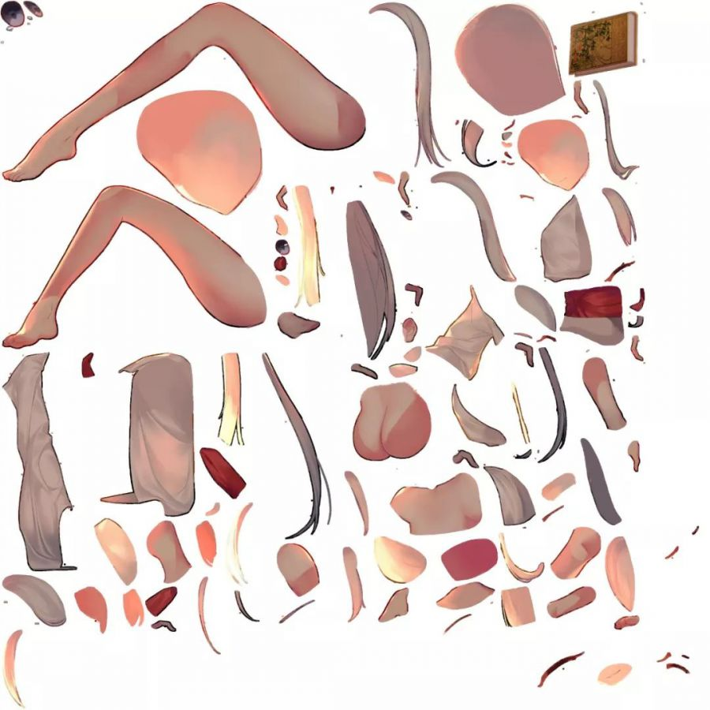
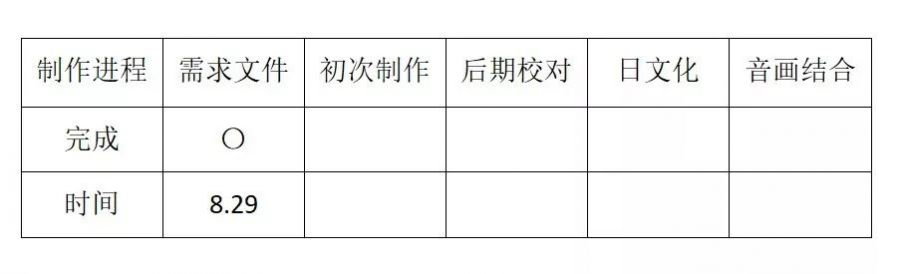
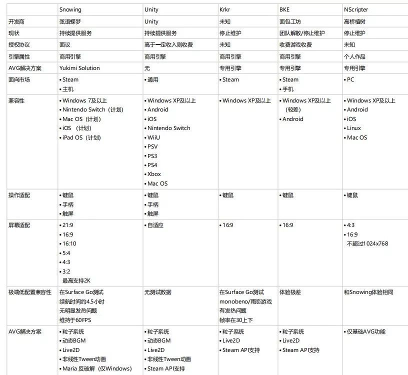
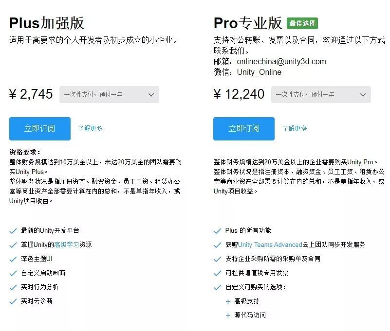
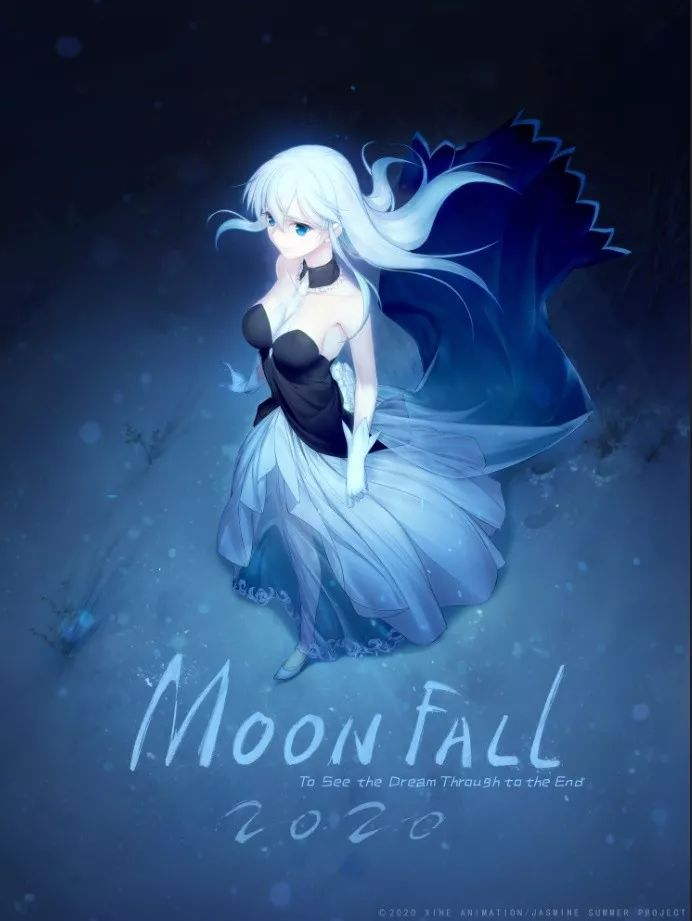
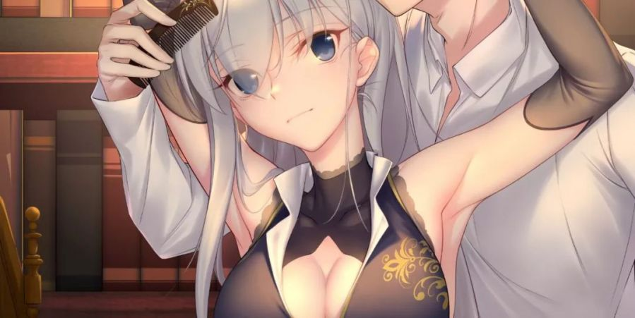

> [原文](http://www.manew.com/thread-148603-1-1.html)

目录

一 明义
1.1商业化galgame意味什么
1.2商业化galgame在国内的前景

二 预算
2.1商业Galgame的预算构成和来源
2.2如何寻找水平相符合的CP以及大体上市场行情

三 构架
3.1部门构架
3.2制作流程构架

四 实施
4.1 引擎选取
4.2 作画管理
4.3 动态演出
4.4 声优延请
4.5 其他外部素材的获取

五 发行
5.1 挑选时发行商必定要注意的事情
5.2 steam发行相关
5.3 其他渠道的发行相关

**一，明义**

**1.1 商业化galgame意味着什么**

商业化Galgame是一个相对的概念，其有别于同人作品的存在（但此处的同人作品亦不同于寻常ACG领域所谈及的同人）。归纳其和同人作品的差异大致如下：

商业化Galgame的**最终目的是盈利**；同人作品的最终（或主要）目的不一定是盈利

商业化Galgame的主体形式多采用公司制，**具有法定代表人**；同人作品的主体形式主要采用社团制，不具备法人

商业化Galgame往往具有**先决预算，稳定的人员构架，较为流程化的制作制度**；同人作品往往需要在制作过程中筹集资金，较为松散的人员构架，较为随性的制作制度。

商业化Galgame往往拥有独立的故事创作以及延伸权益；同人作品可以在一定程度上借鉴和引用他人的故事创作，于一定程度内可以贩售获利，但不应当主张延伸权益。

**1.2商业化Galgame在国内的前景**

商业化制作的Galgame整体市场前景是较之2019年更为优越的，越来越多的玩家愿意购买国产Galgame，总体上来说拓展了市场规模；但是亦存在一些亟待解决的[问题](http://www.manew.com/forum-ask-1.html)，诸如：绝大多数玩家对于定价的敏感，国内售价相较于同类型产品的国际售价往往是后者的六分之一乃至更加向下；一些情况下难以公开大规模宣传等。

关于国内定价较为低下导致游戏本体往往无法取得收益的情况，国内目前主流的解决方案是通过延伸权益：主要是贩售具有高附加值的周边等对于游戏本身的销售情况进行补贴。

关于（国产）商业化Galgame的**Galgame国区1-2W份是比较现实的；3-4万份应当是某些范围内的小小[话题](http://www.manew.com/labe/)作；5万份及以上基本可以认为是当年度的话题作**，即：

正常制作，严格控制预算，总体预算在人民币20-25万元以内的，较为成熟的小型商业化Galgame拥有较高的成本回收比。

正常制作，预算相对松弛的，总体预算在人民币25万-100万元以内的，相对前者较为成熟但是不具备过于明显的质量差距的，此类拥有较低的成本回收比（不太有可能回收成本）

正常制作，预算相对充裕，总体预算在人民币100万元以上的，因为初步具备了质量上和规模上的不同，在取决于是否采用了适当的宣发策略前提下，如能拥有相对较好的宣发策略，能拥有较好的成本回收比（可能回收成本盈利，但是较之第一种周期应当较长）。

这里的100万是一个基础的门槛，并不实指就一定能够达成质量上的明确优越，实际需要考虑到有效制作经费的投入和后续支持，我认为在一定程度上，整体国内galgame发行商宣发是比较支持厂商的，在作品质量达到一定门槛后，发行商所提供的宣传资源如果量化（推广位置以市场价人民币计价）那么几乎都是亏损的。

一般情况下，建议初次尝试商业化制作的，选择上述三种的第一种。

另外提供一个简单的算法，即预定售价X（63%-其他项目内分成或发行商份额）=每份净收入。再算一下整体预算需要多少份销售才能回本，以目前的情况来看，有一定质量的Galgame国区1-2W份是比较现实的；3-4万份应当是某些范围内的小小话题作；5万份及以上基本可以认为是当年度的话题作。如果对于回本有着比较强烈追求的话，那么最好以1W5-2W份销量为目标做预算。

**二 预算**

**2.1 商业化Galgame的预算构成和来源**

**2.1.1 预算构成**

程序预算：1.程序制作费用 2 引擎授权费用

美术预算：1.立绘 2.场景 3.CG 4.UI 5.演出素材 6.宣传物料绘制费用 /1. 人员费用

音声预算：1.音乐费用（内部制作外部取得） 2.音效费用 3.声优费用 4.音轨后期整体处理费用

脚本预算：1.剧本编写费用 2.校对费用 3.翻译费用

演出预算：1.视频剪辑制作 2.动态素材制作 3.演出制作

制作进行预算：1.物料预算 2.人员预算

发行预算：1.平台发行费用预算 2.发行商外宣传渠道预算 3.发行物料制作预算 4.实地发行预算

不可预见费用：**1.不可预见费用 2.额外福利支出 3.试错成本**

**2.1.2 来源**

以商业化galgame制作作为前提，我强烈建议只有在**自有资金**充分的前提下（**保有现金量较之总体预算上浮30%**）开始制作。以众筹资金为主要来源的情况下，建议采用同人制作模式。

**2.2 如何寻找水平相符合的CP以及大体上市场行情**

**同人模式请以SDA（净利润销售分成协议）模式进行**；以商业化制作和充分供给薪资的前提下，建议通过非公开平台下的圈内人士寻找，以公开应征的画师平台X画师为例，同价位下其水平上下限往往存在较大的差距以及存在认证为个人画师实际为作画工作室的情况。

但是大体行情上该网站所给出的定价建议基本上是合理的：**即2000-3000左右能够购买到单张具备一定商业价值的作品，但精度不能做高要求；4000-6000左右能够购买到单张具备商业价值并且作画精度有适当要求的作品**；至于再往上的作品其应当根据个人情况和单张要求进行股价。（这一点我也同样是给画师做参考，尽可能避免不合理的薪资待遇，这点在我们业界其实是比较普遍的。当然你问如果2-3K的水准都达不到怎么办？多学多练多画）

对于作画工作室应当持一个合理的态度，虽然委托工作室作画会较之直接雇佣画师上浮一些费用，但是其作画管理上（前后作画质量一致）较为有保障，但亦不能一概视之，亦有部分工作室存在滥竽充数，前后作画画师不一，质量相差极大的情况。如无法组建自身的作画团队，需要委托雇佣，那么仍然推荐相对来说国内选择比较多的合作工作室(MZL为例)。

Live制作国内亦有成熟的个人以及工作室可以承接该项任务，根据精度，要求的不同，单张**制作价格一般在人民币3000元-人民币8000元**（其中不包括作画）。如能提供详细的分层文件，那么价格上应该可以稍微降低一些。但若是无live2d制作经验的，建议首先交由专业人士负责全程。**请尊重专业人士的价值**，原则上拆分的越细密那么效果也可能越好，如果有经验之后，可以让画师在作画过程中进行图层方面的配和。

录音委托分国内国外两种情况，**国内素养良好的专业CV**（指为主流网络游戏或译制后的国外主流游戏配音的CV，诸如网易暴雪等），其中不乏较为年轻愿意参加此类工作的，一般价格也并不是很高，**大约在人民币20-30元/句区间。**若是较为知名的网络配音那么其价格我认可的指导价位应当低于这个数字。详细建议通过业内人士咨询。

**国外的情况不建议通过中介机构进行委托CV录制，其溢价价格往往较高**（最少50%及以上），虽说对方能够提供现场管理等服务，但是这些服务也是计入费用的。在拥有完善法人资格的前提下，建议直接通过CV育成学校以及事务所进行联络，其中不乏有一些声名不显的宝藏CV启用，其价格也往往是比较合理的。一般相较于中介机构，可能自己从国内去一次要便宜得多。

至于程序制作，音乐制作，剧本等等较之个人差异化比较明显，难以给出一个合理的推介价格区间。但总体上不推荐去一味追求“大佬”，Galgame制作是一个比较流程化而非个性化的制作过程，过强的个性有利于宣传但是不利于实际成品。

整体上来说商业化制作的入门和团队组建还是需要通过一定的业内引荐和人脉介绍才能较好的控制成本。

**三 构架**

**3.1 部门构架**

企划部门：制作人，编剧，监督。

下辖美术部门，程序部门，音声管理部门，制作管理部门，根据情况是否设独立的财务部门

美术部门：美术监督领导，主美（通常与美术监督为同一人），根据素材分为人设画师（原画），场景画师，CG画师，UI画师，素材画师等，可互相兼任

程序部门（因实际需要，演出部门通常和程序置于一处）：主程序员领导，程序员，导演参与领导，视频以及动态效果制作人员

音声管理部门：音响监督领导，CV，音轨处理专员

制作管理部门：由监督领导，其他均为制作进行，负责将所有其他部门的工作成果串联起来。

**3.2 制作流程构架**

3.2.1 企划部门决定企划主要数值：拥有主要数据的裁量权：包括作画量，文本量，预算，发售时间，发售策略，年龄分级等

3.2.2 编剧构建剧本大纲，交由美术部门绘制概念图和主要人设

3.2.3 决定分段施工顺序（通常以文本顺序为准），安排各部门作业，开始遴选CV，购买音像素材根据要求制作。

3.2.4 由制作进行负责串联各个部门，从企划部门获得**分镜文件初次件，**交由美术部门；美术部门监督根据大体分镜准备绘制需求文件分发绘制任务，完成草图后交由制作进行；制作进行将草图填充入分镜文件，获得**台本**；将台本交由CV进行配音（如多国语言则需要翻译之后交由CV），加上后续CV音轨，音效音轨的处理后，得到音画合成件；此后在校对的同时，逐步将草图替换成确实的完整素材图像，根据程序语言脚本化后，得到最终的**脚本文件**。

我们某个章节的实际制作文件日期戳

3.2.5 非必须，但是在一些需要演出效果的地方，需要动态部门在脚本文件的基础上进行处理。这通常需要理解AE软件制作的图像处理方面人员以及程序部门协力才能落实。

3.2.6 非必须，使用制作引擎的前提下可以稍微轻松一些，但是使用了新的程序框架之后应该进行测试。这些可以通过内部群组小范围测试来进行，相当于把二次校对和Debug放在一起。

3.2.7 如果是新开发商，那么应该至少在发售前之前3个月或更早前提交IRS税务信息并且通过Steam开发者认证；至少提前2个月完成商店页面的布置并且审核发布；至少距离发售前28日通过steam程序包审核，方能保证及时的发布。同时相应宣传物料的筹备应当在发售前两个月之前进行筹备。

**四 实施**

这一部分更多是实战层面得出的一些经验和认知，可以作为非决定性的建议以供参考。这一部分希望能够对商业开发者和同人独立开发者都有一定借鉴价值。

**4.1 引擎选取**

说到引擎选取我必须拿一张图来

这是早些日子在其他渠道看到的引擎对比，只能说有意思，但可能需要更加全面的说明现在AVG引擎的内容和情况。

首先以时间顺序来讲，KRKR（含NVLmaker）和NScripter是已经较为成熟和有一些年代的引擎了，和这个表上说的不太一样，根据需求KRKR是可以适配任何屏幕以及绝大多数电脑环境的。但是对一些文件的格式是有着严格的格式要求所以并不算方便。因为其开源且易于编辑和开发的特性，在当下依旧是一个非常合适和易于开发Galgame的平台。特别是NVLmaker十分适合于新人上手，去系统性了解galgame内在程序框架设计的。通过参数修改可以解决绝大多数适配问题；关于一些渲染策略和新系统的适配其实通过魔改亦能实现多数（当然有着魔改实力的话，可能也不需要选择易于上手的引擎）。

**整体上来说非程序员出身的制作人/20万人民币以下小成本制作/同人制作目前看来最为合适的上手引擎仍然是老而弥坚的KRKR和基于它的NVLmaker编辑器。**

其次是BKE以及Unity和其相应适合开发galgame的构架。

BKE（面包工坊）虽然我长期的看好这款引擎，但是目前的确是已经是结束版本迭代了。因此也有各种各样的问题：因为壳的问题steam会表示一定环境下某些杀毒软件会示警；打包需要人力取得打包文件，整体上来说开发难度是要比NVLmaker高很多，目前也是商用引擎，所以可能并不太适合初心者或者小制作组。

Unity是目前主流商业Galgame开发引擎，一般来说商业化Galgame会社的资格情况是超过20万美金这个数字的，应该说是接近或者说超过不多，原则上还是选购加强版即可。主要还是以项目收益来判断自己应该选择的档位，如果说单个项目收益未超过20万美金的，那么使用Plus版不会有太大的问题；如果单个项目收益已经超过20万美金，那么我觉得即使是购买专业版服务该买就买了吧，付费也确实合理。如果心疼的话可以选择在游戏上线前一到两个月再购买付费的席位（注：2020年中国区Unity付费有提价的风传，加强版可能提至4000人民币/年左右，未证实）

基于Unity的galgame开发框架有UTAGE以及目前我们所使用的UFG框架，但事实上能够较好的运用Unity开发游戏的程序员多数都是有自主写出程序框架能力的；**Unity也适配于各种各样的移动和主机平台，所以单纯就商业化Galgame的制作来说首选应当是Unity**

其他商业引擎，为galgame量身定做也好，或适配galgame也好，均不太适合做商业或着同人开发；即便是学生只是为了兴趣希望了解开发galgame，也尽可能不要选择此类预付费或者一次性付费的galgame制作引擎。说白了有浪费零花钱的嫌疑。

另外为了对Galgame的同人开发和小规模开发者提供一定程度的支持，我们考虑将在明年以我们所用的Unity，UFG框架，以及目前基于Web，后续适配到本地的Avgplus两款引擎开源一组完整的高精度UI皮肤，一组高精度4K场景图像素材以支持初心者的开发历程。

**4.2 作画管理**

**4.2.1 两种作画模式**

作画管理之前谈过，主要分为两种模式，一种是不同画师尽快尽可能统一作画画风；一种是将作画拆解为概念，草图，色彩指定，线稿，上色等多个部份交由复数画师处理。目前关于这两者的优劣，我们个人的体验是这样的：

假定该项目总作画量为一到两名画师一年（项目周期）里能够完成的量，那么采用前者较为合适，其经济效益相对来说较高；假定该项目总作画量需要三名及以上画师一年（项目周期）里能够完成的量，那么则采用后者会比较好。

Galgame开发本质上是一个重人力成本行业，尤其是作画一般占了总预算的半壁江山以上。而采用拆解后的流程化作画，那么至少需要组建一个至少3名全职画师为基础的团队。相对来说人力成本是较高的，同等条件下在日本或者中国本地组建和维持团队的成本是相近乃至于中国本地的成本是更高的；整体来说我们还是比较缺乏到达一定水平线以上，画风稳定的画师基数以及一个较为成熟，能够互相拆借和复用作画和演出团队的业界。

**4.2.2 作画管理的流程**

建议以：绘制需求—草图—色稿—线稿—上色稿—完成稿—差分这一流程进行作画，

**4.3 动态演出**

**4.3.1 live2d相关见2.2**

**4.3.2 其他动态演出方法**

目前主流的动态演出方案是播片（视频），帧动画（动画），live2d（补间动画），AE（以AE的思路实现素材运动）这四种。

如果说是以AE思路制作的话，往往需要AE制作方面的人才提供思路；画师提供素材；程序提供实现三者共同协力，是一个比较繁复需要沟通的过程，不过总体效用较好。

帧动画或者补间动画的其中有一点是要提醒的，比如说一秒的动作需要准备了12张，其顺序不应当是完整的1.2.3……，而应该是1.23.34.5……类推，即两个静态的帧之间可以用两张图混合模糊来体现，这样结果上会更加自然一些。

**4.4 声优延请 见2.2**

**4.5 外部素材获取**

并不是所有素材都需要通过本地获取的，一些付费的蒙版贴图素材可以在Unity商店社区以及国外的论坛得到；音乐方面的可以尝试目前比较流行的音乐版权交易，一首单曲永久的全球授权价位仅在899-1299之间，较之制作成本相对来说是较低的；同时不建议使用无版权或非明确共享开源的曲子，像是国内版权代理商北京音未方面对类似的行为索偿会相当积极，因此不如买；日本一些论坛也有曲包购买，可以尝试一下，但是要注意其**授权范围，一些不能用于商业作品的建议不要购买**。

另外要提到的是字体问题，字体方面除去一些明确可以公开使用的外，其他商用多数是要付钱的，一些艺术字体更是如此。典型的包括EVA明朝体，Khara的日亚上有售（20000日元）。此类问题需要在商业制作中规范应对。

**五 发行**

**5.1在挑选发行商时必须要注意的事项**

拒绝制式合同，作为开发者一定要仔细看清协议内容，关键点具体包括：**支付账期，预付，销售分成，支付形式，是否有保底，是否有阶梯分成，是否规定了发行商发行义务和发行规模，游戏发行之外的其他权益等。**

同时和下面都有相关的一点是，**程序包不能私下的通过各种形式交给发行商**，而应该通过Steam后台程序包权限分享的功能让发行商进行预览，并在临近发行时将程序包通过steam程序包转让的官方途径交给发行商，同时保留自己账号的财务数据观看权限。

这一举动的主要意义是，当发行商不能履行其职责时，可以通过steam客服介入收回程序包权限；其成功的案例是一款生存射击游戏，发行商未能履行其发行义务且没有支付给开发商销售分成的时候，开发商通过该渠道追索回了程序包和其他权限；不那么成功的案例参见请问2019年国内轻文倒闭其引擎相关涉及游戏面临的困难。一旦有程序包转交记录，那么通过Steam客服是能要回程序包权限并且更改引擎重新上架的。

**5.2 Steam发行相关**

发行相关见3.2.7，

其他讲一些Steam的审核机制相关，事实上steam目前并不禁止成人内容，但是严厉禁止未成年涩情。这一点的判断依据有两个，一方面是文本依据，即文本设定里不能体现这一点；有一方面是事实依据，即外观事实上不能够让人觉得是涉及这方面的内容（指的就是合法萝莉这一点）。其并不只是单纯的不涉及性行为即可，擦边球也不允许，另外近年来V社在方面应该说相当上路，审核人员的审核意见越来越专业。经判断应该是具有了对国语专门的审核人员进行审核。

另外关于涉及的标签包括“裸露”“成人内容”等，建议如实打上并且填写问卷，R18内容DLC化steam原则上认可。但是**对于“欺瞒”这样的行为V社并不赞赏**。诚实的填写分类和标签有助于steam将这些游戏推送到更加感兴趣的人手中（Steam实验室功能)。

**5.3 其他发行渠道**

关于实体发行等均处于灰色地带，但是原则上不建议印刷具有一定文本量的书籍；刻盘；U盘等形式进行实体贩售，最好实体也是事物加上兑换码。原则上这是高压线，即使没有触碰到，但是应该不会有人想去试试触电之后会怎么样。

作者：林叶
