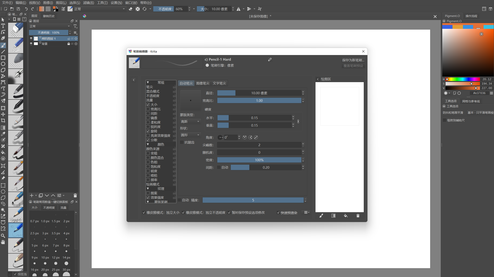

# Krita调教 PS使用习惯

- 键盘快捷键 & 画布快捷键👉PS
- 画笔橡皮快捷键插件：[ThreeSlots - 三组笔刷预设独立选项记忆与快捷键](https://github.com/DarkDefender/threeslots)
- 橡皮独立使用：F5 左下角 ，橡皮擦：独立大小 & 透明度
- 笔刷：没整理
- 动作：暂未制作，基本功能暂时够用
- 工作区界面：

## 常用快捷键：

色盘：shift I

油漆桶：shift G
