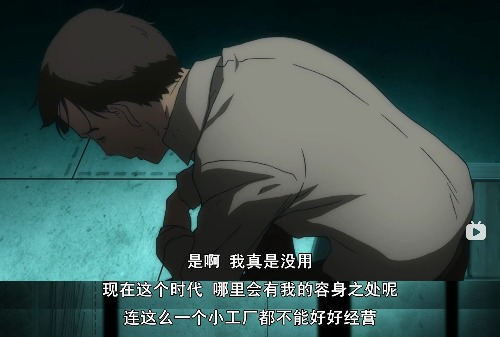

《魔法少女小圆》推荐及
番剧内反应的日本社会现象

## 番剧简介

魔法少女小圆——爱与希望的物语
治愈（√）
致郁（√）

- SHAFT
  - [绝望先生](https://baike.baidu.com/item/%E7%BB%9D%E6%9C%9B%E5%85%88%E7%94%9F?fromModule=lemma_inlink)
  - 物语系列
  - 三月的狮子
- 主创人员
  - 导演监督：新房昭之，[宫本幸裕](https://baike.baidu.com/item/%E5%AE%AB%E6%9C%AC%E5%B9%B8%E8%A3%95/3753184?fromModule=lemma_inlink)
  - 编剧：虚渊玄
  - 异空间设计：[剧团犬咖喱](https://zh.moegirl.org.cn/%E5%89%A7%E5%9B%A2%E7%8A%AC%E5%92%96%E5%96%B1)
  - 音乐：[梶浦由记](https://zh.moegirl.org.cn/%E6%A2%B6%E6%B5%A6%E7%94%B1%E8%AE%B0 "梶浦由记")
  - ……
- 声优
  - [鹿目圆](https://zh.moegirl.org.cn/%E9%B9%BF%E7%9B%AE%E5%9C%86 "鹿目圆")：[悠木碧](https://zh.moegirl.org.cn/%E6%82%A0%E6%9C%A8%E7%A2%A7 "悠木碧")
  - [晓美焰](https://zh.moegirl.org.cn/%E6%99%93%E7%BE%8E%E7%84%B0 "晓美焰")：[斋藤千和](https://zh.moegirl.org.cn/%E6%96%8B%E8%97%A4%E5%8D%83%E5%92%8C "斋藤千和")
  - [美树沙耶香](https://zh.moegirl.org.cn/%E7%BE%8E%E6%A0%91%E6%B2%99%E8%80%B6%E9%A6%99 "美树沙耶香")：[喜多村英梨](https://zh.moegirl.org.cn/%E5%96%9C%E5%A4%9A%E6%9D%91%E8%8B%B1%E6%A2%A8 "喜多村英梨")
  - [巴麻美](https://zh.moegirl.org.cn/%E5%B7%B4%E9%BA%BB%E7%BE%8E "巴麻美")：[水桥香织](https://zh.moegirl.org.cn/%E6%B0%B4%E6%A1%A5%E9%A6%99%E7%BB%87)
  - [佐仓杏子](https://zh.moegirl.org.cn/%E4%BD%90%E4%BB%93%E6%9D%8F%E5%AD%90 "佐仓杏子")：[野中蓝](https://zh.moegirl.org.cn/%E9%87%8E%E4%B8%AD%E8%93%9D "野中蓝")
  - [丘比](https://zh.moegirl.org.cn/%E4%B8%98%E6%AF%94 "丘比")：[加藤英美里](https://zh.moegirl.org.cn/%E5%8A%A0%E8%97%A4%E8%8B%B1%E7%BE%8E%E9%87%8C "加藤英美里")
 唯一同时获得日本动画指标性三大奖的电视动画，也是史上获奖最多的日本电视动画。
 至2013年7月全球创收已逾400亿日元，并陆续获选为酷日本战略推进作品及[AnimeJapan](https://zh.moegirl.org.cn/index.php?title=AnimeJapan&action=edit&redlink=1 "AnimeJapan（页面不存在）")动画半世纪代表作之一。

本片：tv，剧场版123
[和我签订契约，成为魔法少女吧](https://zh.moegirl.org.cn/%E5%92%8C%E6%88%91%E7%AD%BE%E8%AE%A2%E5%A5%91%E7%BA%A6%EF%BC%8C%E6%88%90%E4%B8%BA%E9%AD%94%E6%B3%95%E5%B0%91%E5%A5%B3%E5%90%A7 "和我签订契约，成为魔法少女吧")
补充资料：

- 魔法少女小圆 - 萌娘 <https://zh.moegirl.org.cn/%E9%AD%9)4%E6%B3%95%E5%B0%91%E5%A5%B3%E5%B0%8F%E5%9C%86>
- 衍生漫画推荐：
  - [魔法少女小焰☆田村](https://zh.moegirl.org.cn/%E9%AD%94%E6%B3%95%E5%B0%91%E5%A5%B3%E5%B0%8F%E7%84%B0%E2%98%86%E7%94%B0%E6%9D%91)
    - 漫画作者：あfろ（[摇曳露营△ / ゆるキャン△](https://zh.moegirl.org.cn/%E6%91%87%E6%9B%B3%E9%9C%B2%E8%90%A5 "摇曳露营")）
  - [小圆☆一家秀](https://zh.moegirl.org.cn/%E5%B0%8F%E5%9C%86%E4%B8%80%E5%AE%B6%E7%A7%80 "小圆一家秀")

## 社会压抑的现象，自杀

剧中出现2次自杀桥段
 一次跳楼自杀
 .jpg)
一次工厂集体自杀
 
 
现实中，日本是个自杀率很高的国家，日本社会很压抑

- WHO 2019 自杀率 数据
- No.6 韩国 27.30 / 十万
- No.7 俄罗斯 26.61 / 十万
- No.12 日本19.39 / 十万
- No.19 印度14.05 / 十万
- No.21 美国 13.83 / 十万
- No.38 中国 8.68 / 十万

- 2018《自杀对策白皮书》日本是唯一一个15-35岁 的年轻人自杀率超高的国家
  - 学生，前途无望，找工作压力大
  - 社畜过度劳动，职场压力
 失去的20年
 青木原树海，自杀森林
 非常不喜欢麻烦别人
 等级观念和严格
 自杀文化。武士道精神，以死谢罪
 大部分韩国人生活得还远不如中国人快乐，不仅压力极大，而且社会贫富分化极其严重。

剧中自杀桥段的原因皆为魔女的诱导，但是冲对白中可以看出，其实说的还是角色自己生活上的困苦

## 日本社会女性的社会地位

日本是一个典型的男权社会，男尊女卑是全民共识。
诱骗少女走向牺牲自己换来大环境的进步，以看待工具的态度看待魔法少女，其实是掌权者的弱势群体的控制（父权对女性的压迫）（主要是职场到家庭的关系）
教育医疗并没有不平等的现象，日本男女教育
并且相关的福利都比较先进

剧中小圆是父母姐弟4人的家庭，其中父亲是家庭煮夫，而母亲则是供养家庭的事业女强人，

红线是全职太太家庭，黑色是双职工家庭

但是少女们反抗残酷的命运，向无情的世界说不，通过自己的努力和抉择向观众传达爱与希望，真是让人热血沸腾。

泡沐经济破掉之后，现象越发明显，女人不再依附男人生活
经济衰退之后，家庭

这种现实中，男尊女卑，女性在家庭和职场中的不平等与歧视，在番剧中被反差的表现为了相反的情况，失业女强人，被规则化boss化的强权控制QB，少女们对自己命运的反抗。

## 魔法少女小圆的美术风格

魔女结界

- 画风诡异，充斥这非现实主义的要素
- 和软萌的魔法少女形成鲜明的反差
珂拉琪Collage

---
> 虽然要点有点散，但都是魔圆故事要素的介绍，方便大家更好的欣赏这部优秀的动画，同时也能找到一些有趣的衍生作品。
> 

有时候是 吧
